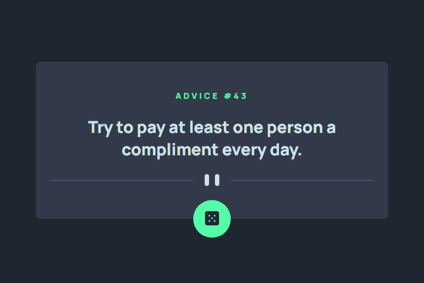

# Frontend Mentor - Advice generator app solution

### The challenge

Users should be able to:

- View the optimal layout for the app depending on their device's screen size
- See hover states for all interactive elements on the page
- Generate a new piece of advice by clicking the dice icon

### Screenshot

### Links

- Solution URL: [https://github.com/gbmouraa/frontend_mentor_challenges/tree/main/advice_generator_app](https://github.com/gbmouraa/frontend_mentor_challenges/tree/main/advice_generator_app)
- Live Site URL: [https://gbmouraa-advice-generator-app.netlify.app/](https://gbmouraa-advice-generator-app.netlify.app/)

### What I learned

This is my first time using Fetch API , and i am very excited to create more projects like this :smiley:

## Author

- Frontend Mentor - [@gbmouraa](https://www.frontendmentor.io/profile/gbmouraa)
- Linkedin - [Gabriel Moura](https://www.linkedin.com/in/gabriel-moura-b63382161/)

