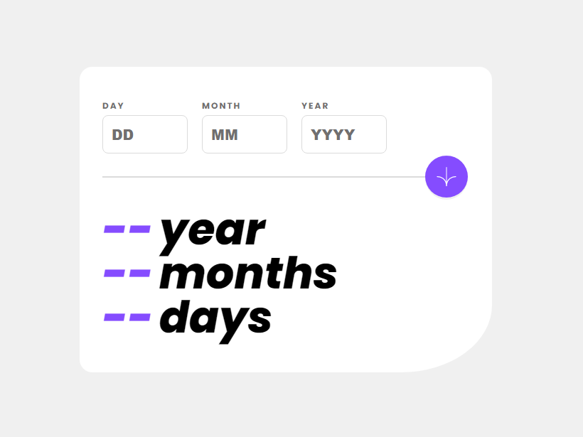

# Frontend Mentor - Age calculator app solution

### The challenge

Users should be able to:

- View an age in years, months, and days after submitting a valid date through the form
- Receive validation errors if:
  - Any field is empty when the form is submitted
  - The day number is not between 1-31
  - The month number is not between 1-12
  - The year is in the future
  - The date is invalid e.g. 31/04/1991 (there are 30 days in April)
- View the optimal layout for the interface depending on their device's screen size
- See hover and focus states for all interactive elements on the page

### Screenshot

### Links

- Solution URL: [https://github.com/gbmouraa/frontend_mentor_challenges/tree/main/age_calculator](https://github.com/gbmouraa/frontend_mentor_challenges/tree/main/age_calculator)
- Live Site URL: [https://gbmouraa-age-calculator.netlify.app/](https://gbmouraa-age-calculator.netlify.app/)

## Author

- Frontend Mentor - [@gbmouraa](https://www.frontendmentor.io/profile/gbmouraa)
- Linkedin [Gabriel Moura](https://www.linkedin.com/in/gabriel-moura-b63382161/)

