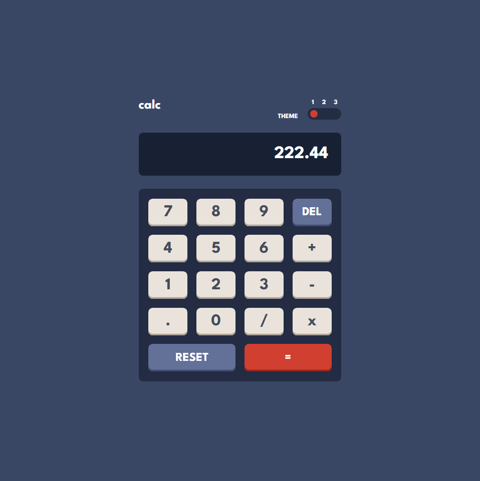
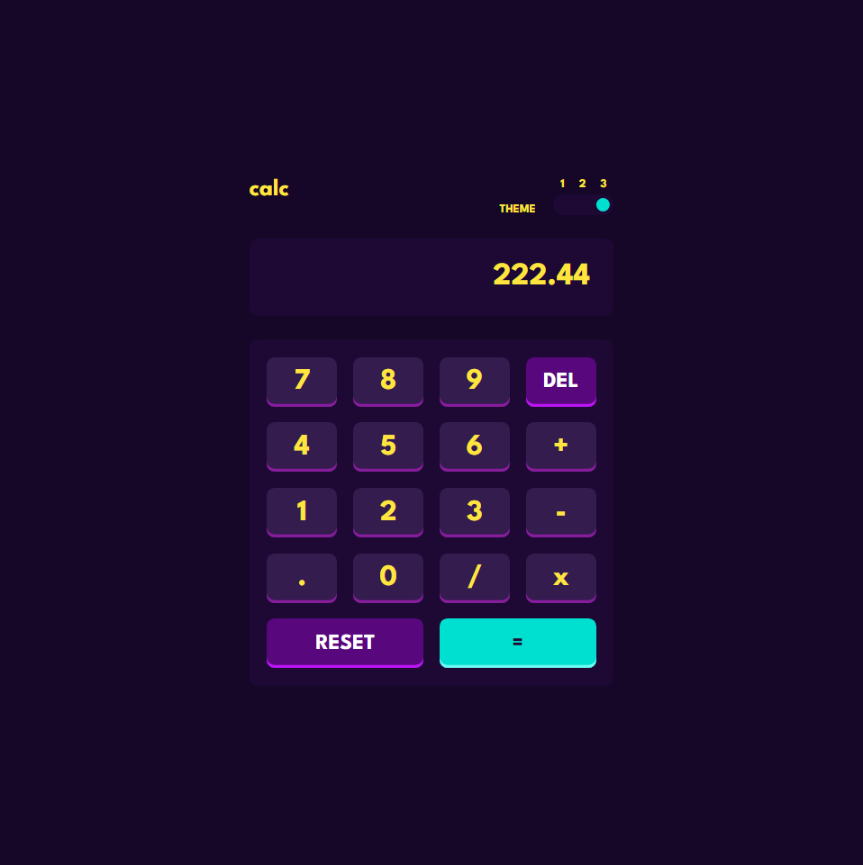

# Frontend Mentor - Calculator app solution

Esta é uma solução para o [Calculator app challenge on Frontend Mentor](https://www.frontendmentor.io/challenges/calculator-app-9lteq5N29).

### O desafio 💻

Os usuários devem ser capazes de:

- Ver o layout ideal para o componente em função do tamanho do ecrã do seu dispositivo
- Realizar operações matemáticas como adição, subtração, multiplicação e divisão
- Ajustar o tema de cores com base em suas preferências

### Screenshot

### Links

- **Reposítorio URL**: [https://github.com/gbmouraa/frontend_mentor_challenges/tree/main/calculator_app](https://github.com/gbmouraa/frontend_mentor_challenges/tree/main/calculator_app)
- **Live Site URL**: [https://gbmoura-calculator-app.netlify.app/](https://gbmoura-calculator-app.netlify.app/)

### Tecnologias Utilizadas :rocket:

- **HTML**: Linguagem de marcação usada para criar e estruturar conteúdo em páginas web, usando tags para definir e organizar elementos como texto, imagens e links.
- **SCSS**: Uma extensão da linguagem CSS que oferece funcionalidades adicionais, como variáveis, aninhamento e mixins, facilitando a escrita e organização de estilos para páginas web.
- **Javascript**:  Linguagem de programação utilizada para tornar as páginas web interativas, permitindo a manipulação dinâmica de conteúdo, interações do usuário e comportamento da página

## Autor

- **Portfólio** - [Gabriel Moura](https://gmouradev.netlify.app/)
- **Frontend Mentor** - [@gbmouraa](https://www.frontendmentor.io/profile/gbmouraa)
- **Linkedin** - [Gabriel Moura](https://www.linkedin.com/in/gabriel-moura-b63382161/)
