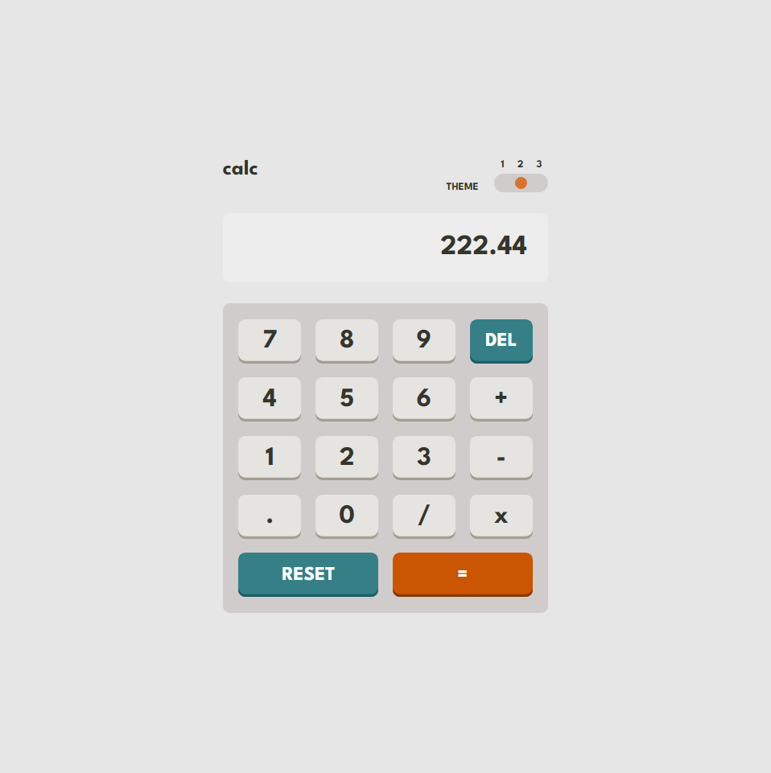

# Frontend Mentor - Calculator app solution

This is a solution to the [Calculator app challenge on Frontend Mentor](https://www.frontendmentor.io/challenges/calculator-app-9lteq5N29).

### The challenge

Users should be able to:

- See the size of the elements adjust based on their device's screen size
- Perform mathmatical operations like addition, subtraction, multiplication, and division
- Adjust the color theme based on their preference

### Screenshot

### Links

- Solution URL: [Add solution URL here](https://your-solution-url.com)
- Live Site URL: [Add live site URL here](https://your-live-site-url.com)

### Built with

- Sass
- Javascript

## Author

- Frontend Mentor - [@gbmouraa](https://www.frontendmentor.io/profile/gbmouraa)
- Linkedin - [Gabriel Moura](https://www.linkedin.com/in/gabriel-moura-b63382161/)
