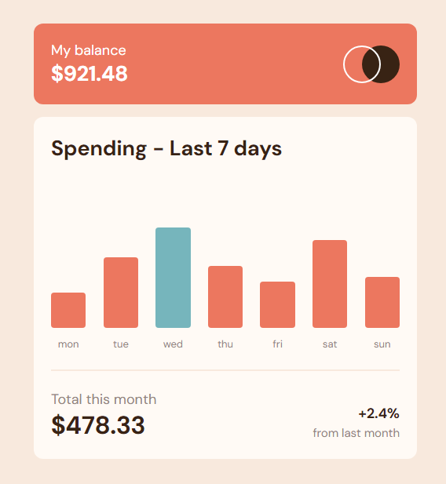
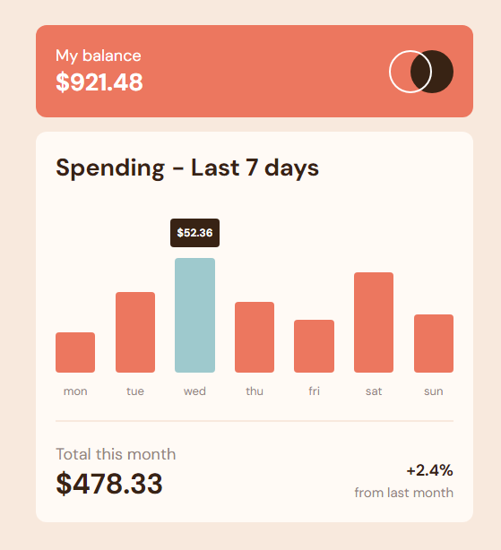

# Frontend Mentor - Expenses chart component solution

This is a solution to the [Expenses chart component challenge on Frontend Mentor](https://www.frontendmentor.io/challenges/expenses-chart-component-e7yJBUdjwt). 

### The challenge

Users should be able to:

- View the bar chart and hover over the individual bars to see the correct amounts for each day
- See the current day’s bar highlighted in a different colour to the other bars
- View the optimal layout for the content depending on their device’s screen size
- See hover states for all interactive elements on the page
- **Bonus**: Use the JSON data file provided to dynamically size the bars on the chart

### Screenshot

### Links

- Solution URL: [https://github.com/gbmouraa/frontend_mentor_challenges/tree/main/expenses_chart_component](https://github.com/gbmouraa/frontend_mentor_challenges/tree/main/expenses_chart_component)
- Live Site URL: [https://gbmouraa-expenses-chart.netlify.app/](https://gbmouraa-expenses-chart.netlify.app/)

### Built with

- Semantic HTML5 markup
- Flexbox
- Mobile-first workflow
- Javascript

### What I learned

This was my first project in which I used a json file, I think the code could have been better, little by little I'm learning more and I'll be able to refactor it to make it good

## Author

- Frontend Mentor - [@gbmouraa](https://www.frontendmentor.io/profile/gbmouraa)
- Linkedin - [Gabriel Moura](https://www.linkedin.com/in/gabriel-moura-b63382161/)
