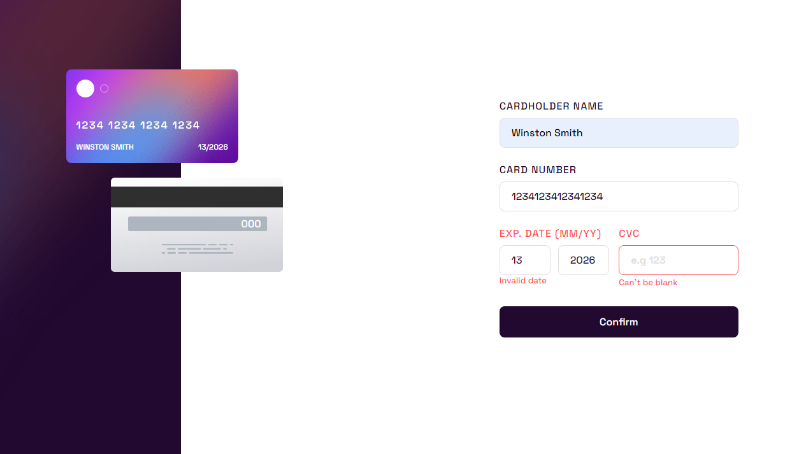

### The challenge

Users should be able to:

- Fill in the form and see the card details update in real-time
- Receive error messages when the form is submitted if:
  - Any input field is empty
  - The card number, expiry date, or CVC fields are in the wrong format
- View the optimal layout depending on their device's screen size
- See hover, active, and focus states for interactive elements on the page

### Screenshot

### Links

- Solution URL: [https://github.com/gbmouraa/frontend_mentor_challenges/tree/main/interactive_card_details_form](https://github.com/gbmouraa/frontend_mentor_challenges/tree/main/interactive_card_details_form)
- Live Site URL: [https://gbmoura-interactive-card-details-form.netlify.app/](https://gbmoura-interactive-card-details-form.netlify.app/)

### Built with

- Semantic HTML5 markup
- Sass
- Flexbox
- Mobile-first workflow

## Author

- Frontend Mentor - [@gbmouraa](https://www.frontendmentor.io/profile/gbmouraa)
- Linkedin - [Gabriel Moura](https://www.linkedin.com/in/gabriel-moura-b63382161/)
