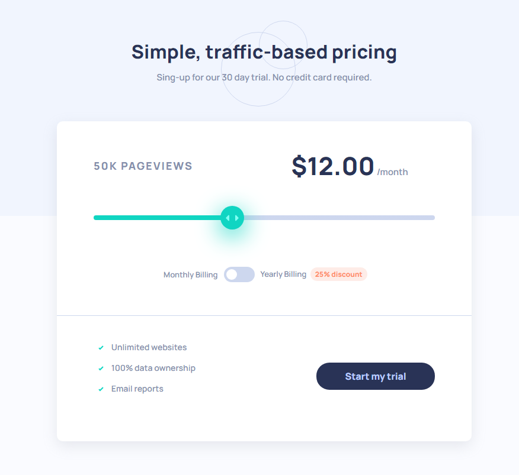
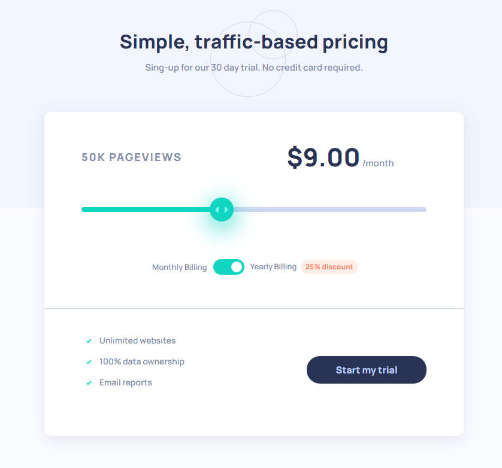

# Frontend Mentor - Interactive pricing component solution

This is a solution to the [Interactive pricing component challenge on Frontend Mentor](https://www.frontendmentor.io/challenges/interactive-pricing-component-t0m8PIyY8).

### The challenge

Users should be able to:

- View the optimal layout for the app depending on their device's screen size
- See hover states for all interactive elements on the page
- Use the slider and toggle to see prices for different page view numbers

### Screenshot

### Links

- Live Site URL: [https://gbmoura-interactivepricingcomp.netlify.app/](https://gbmoura-interactivepricingcomp.netlify.app/)
- Solution URL: [https://github.com/gbmouraa/frontend_mentor_challenges/tree/main/interactive_pricing_component](https://github.com/gbmouraa/frontend_mentor_challenges/tree/main/interactive_pricing_component)

## Author

- Frontend Mentor - [@gbmouraa](https://www.frontendmentor.io/profile/gbmouraa)
- Linkedin - [Gabriel Moura](https://www.linkedin.com/in/gabriel-moura-b63382161/)

