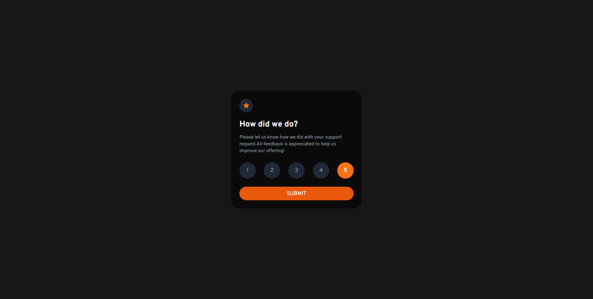
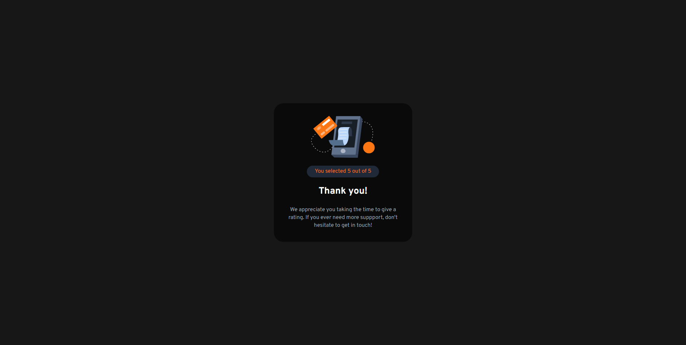

# Frontend Mentor - Interactive rating component solution

This is a solution to the [Interactive rating component challenge on Frontend Mentor](https://www.frontendmentor.io/challenges/interactive-rating-component-koxpeBUmI).

### The challenge

Users should be able to:

- View the optimal layout for the app depending on their device's screen size
- See hover states for all interactive elements on the page
- Select and submit a number rating
- See the "Thank you" card state after submitting a rating

### Screenshot

### Links

- Solution URL: [https://github.com/gbmouraa/frontend_mentor_challenges/tree/main/interactive_rating](https://github.com/gbmouraa/frontend_mentor_challenges/tree/main/interactive_rating)
- Live Site URL: [https://gbmoura-interactive-rating.netlify.app/](https://gbmoura-interactive-rating.netlify.app/)

### Built with

- Tailwind
- Gsap

## Author

- Linkedin - [Gabriel Moura](https://www.linkedin.com/in/gabriel-moura-b63382161/)
- Frontend Mentor - [@gbmouraa](https://www.frontendmentor.io/profile/gbmouraa)
