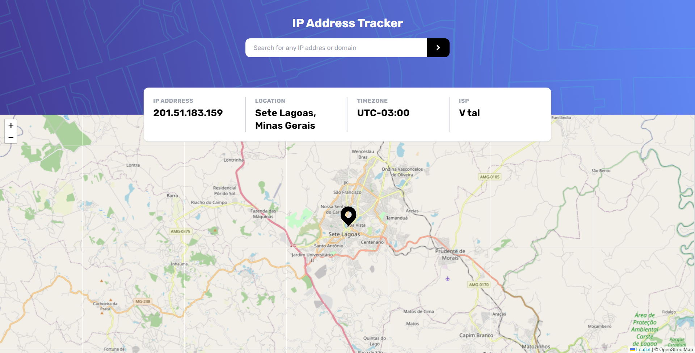

# Frontend Mentor - IP address tracker 

Essa é uma solução para o [IP address tracker challenge on Frontend Mentor](https://www.frontendmentor.io/challenges/ip-address-tracker-I8-0yYAH0).

### O desafio 💻

Os usuários devem ser capazes de:

- Ver o layout ideal para o componente em função do tamanho do ecrã do seu dispositivo
- Ver os estados de hover de todos os elementos interativos da página
- Ver seu próprio endereço IP no mapa no carregamento inicial da página
- Pesquise qualquer endereço IP ou domínio e veja as principais informações e o local

### Screenshot

### Links

- **Reposítorio URL**: [https://github.com/gbmouraa/frontend_mentor_challenges/tree/main/ip_address_tracker](https://github.com/gbmouraa/frontend_mentor_challenges/tree/main/ip_address_tracker)
- **Live Site URL**: [https://gbmoura-ip-address-tracker.netlify.app/](https://gbmoura-ip-address-tracker.netlify.app/)

### Tecnologias Utilizadas :rocket:

- **HTML**: Linguagem de marcação usada para criar e estruturar conteúdo em páginas web, usando tags para definir e organizar elementos como texto, imagens e links.
- **Tailwind CSS**: Um framework CSS que oferece várias classes para utilização já pré-estilizadas.
- **Javascript**:  Linguagem de programação utilizada para tornar as páginas web interativas, permitindo a manipulação dinâmica de conteúdo, interações do usuário e comportamento da página

## Autor

- **Portfólio** - [Gabriel Moura](https://gmouradev.netlify.app/)
- **Frontend Mentor** - [@gbmouraa](https://www.frontendmentor.io/profile/gbmouraa)
- **Linkedin** - [Gabriel Moura](https://www.linkedin.com/in/gabriel-moura-b63382161/)
