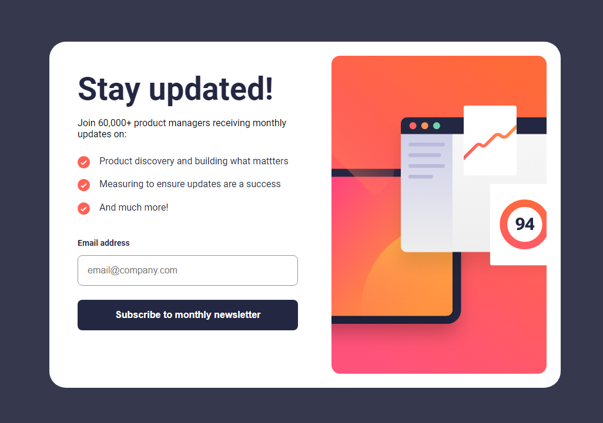
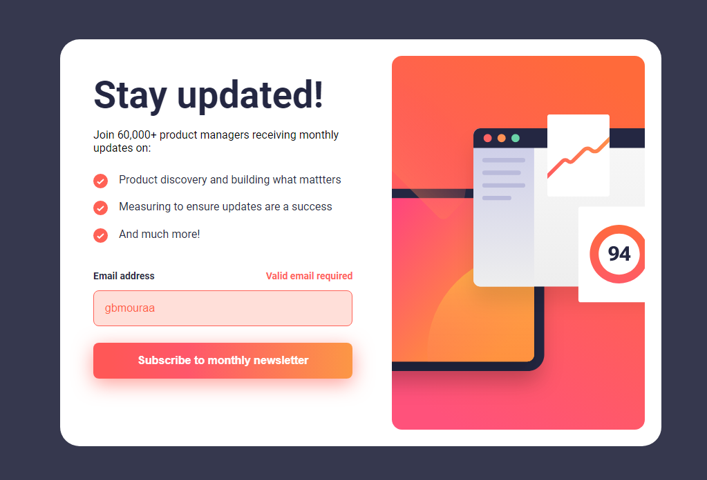
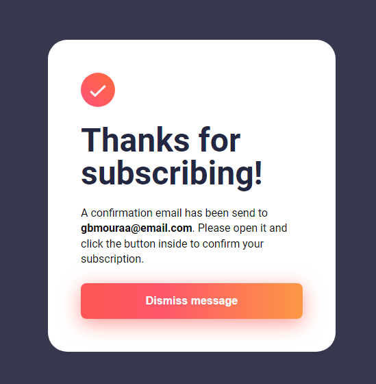

# Frontend Mentor - Newsletter sign-up form with success message solution
## Overview
### The challenge

Users should be able to:

- Add their email and submit the form
- See a success message with their email after successfully submitting the form
- See form validation messages if:
  - The field is left empty
  - The email address is not formatted correctly
- View the optimal layout for the interface depending on their device's screen size
- See hover and focus states for all interactive elements on the page

### Screenshot

### Links

- Solution URL: [https://github.com/gbmouraa/frontend_mentor_challenges/tree/main/newsletter_sign_up](https://github.com/gbmouraa/frontend_mentor_challenges/tree/main/newsletter_sign_up)
- Live Site URL: [https://gbmouraa-newsletter-sign-up.netlify.app/](https://gbmouraa-newsletter-sign-up.netlify.app/)

## Author

- Frontend Mentor - [@gbmouraa](https://www.frontendmentor.io/profile/gbmouraa)
- Linkedin - [Gabriel Moura](https://www.linkedin.com/in/gabriel-moura-b63382161/)
 
