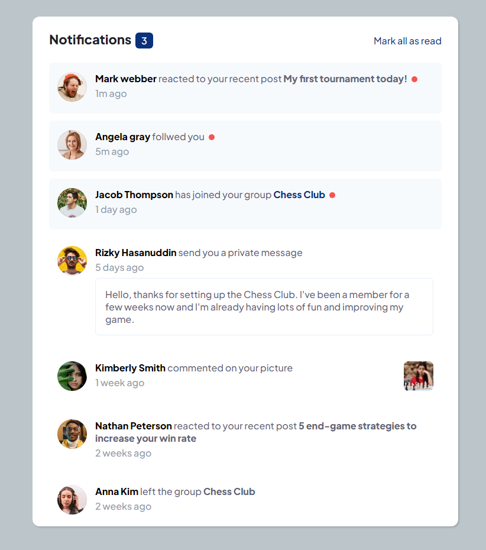

### The challenge

Users should be able to:

- Distinguish between "unread" and "read" notifications
- Select "Mark all as read" to toggle the visual state of the unread notifications and set the number of unread messages to zero
- View the optimal layout for the interface depending on their device's screen size
- See hover and focus states for all interactive elements on the page

### Screenshot

### Links

- Solution URL: [https://github.com/gbmouraa/notification_page](https://github.com/gbmouraa/notification_page)
- Live Site URL: [https://gbmouraa.github.io/notification_page/](https://gbmouraa.github.io/notification_page/)

### Built with

- CSS custom properties
- Flexbox
- Sass
- Saas mixins
- jQuery
- Mobile-first workflow

### What I learned

This was my first time using jQuery in a project, so I could learn more about how this technology works, and I enjoyed this experience!

## Author

- Frontend Mentor - [@gbmouraa](https://www.frontendmentor.io/profile/gbmouraa)
- Linkedin - [Gabriel Moura](https://www.linkedin.com/in/gabriel-moura-b63382161/)