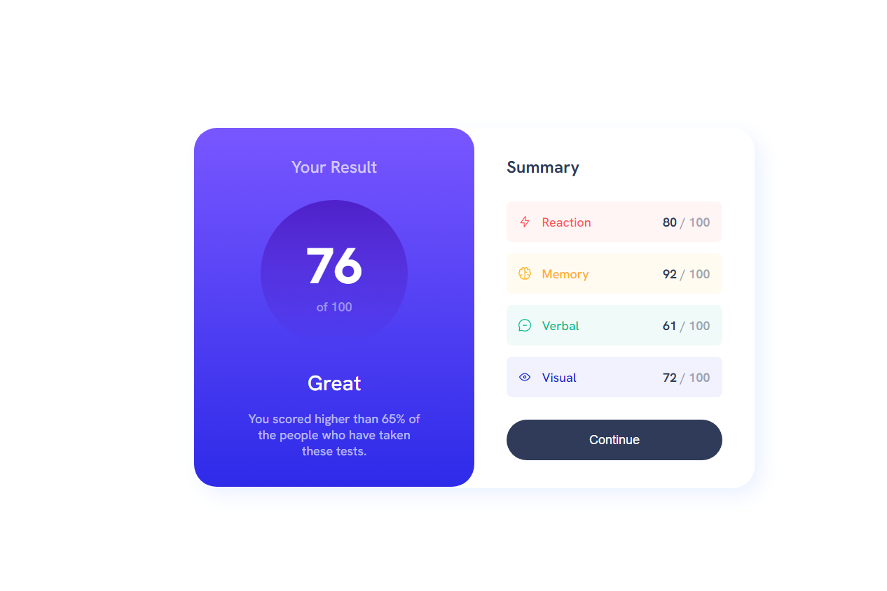
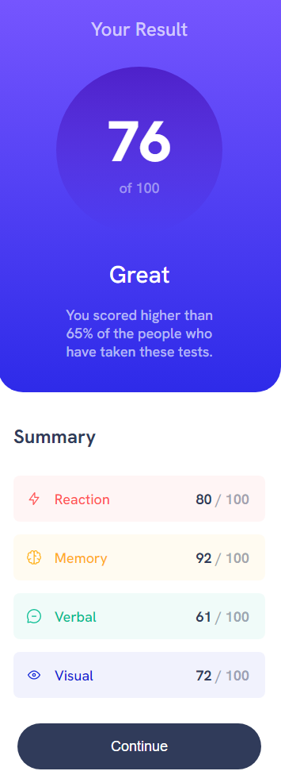

# Frontend Mentor - Results summary component solution

This is a solution to the [Results summary component challenge on Frontend Mentor](https://www.frontendmentor.io/challenges/results-summary-component-CE_K6s0maV).  

### Screenshot

### Links

- Solution URL: [https://github.com/gbmouraa/frontend_mentor_challenges/tree/main/results_summary_component](https://github.com/gbmouraa/frontend_mentor_challenges/tree/main/results_summary_component)
- Live Site URL: [https://gbmoura-results-summary.netlify.app/](https://gbmoura-results-summary.netlify.app/)

### Built with

- Semantic HTML5 markup
- CSS custom properties
- Flexbox
- CSS Grid
- Sass

## Author

- Website - [Gabriel Moura](https://www.linkedin.com/in/gabriel-moura-b63382161/)
- Frontend Mentor - [@gbmouraa](https://www.frontendmentor.io/profile/gbmouraa)
