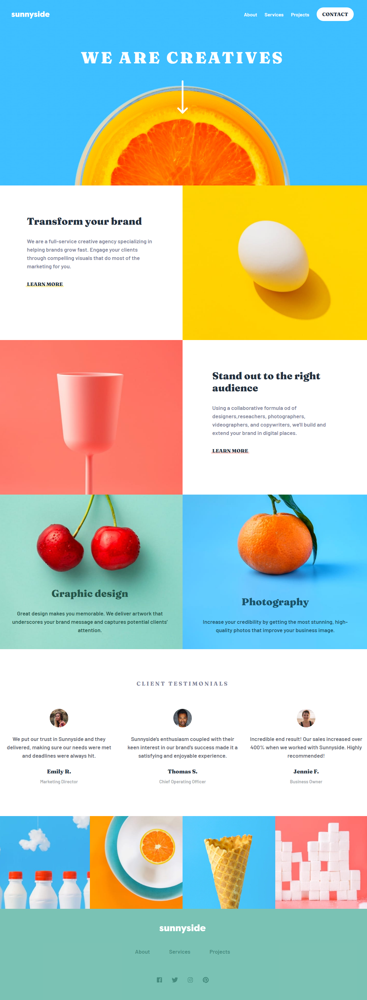
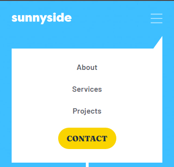

# Frontend Mentor - Sunnyside agency landing page solution

## Overview

### The challenge

Users should be able to:

- View the optimal layout for the site depending on their device's screen size
- See hover states for all interactive elements on the page

### Screenshot

### Links

- Solution URL: [https://github.com/gbmouraa/frontend_mentor_challenges/tree/main/sunnyside_landing_page](https://github.com/gbmouraa/frontend_mentor_challenges/tree/main/sunnyside_landing_page)
- Live Site URL: [https://gbmouraa-sunnyside-landing-page.netlify.app/](https://gbmouraa-sunnyside-landing-page.netlify.app/)

## My process

### Built with

- Semantic HTML5 markup
- Sass
- Flexbox
- CSS Grid
- Mobile-first workflow

## Author

- Frontend Mentor - [@gbmouraa](https://www.frontendmentor.io/profile/gbmouraa)
- Linkedin - [https://www.linkedin.com/in/gabriel-moura-b63382161/](https://www.linkedin.com/in/gabriel-moura-b63382161/)
